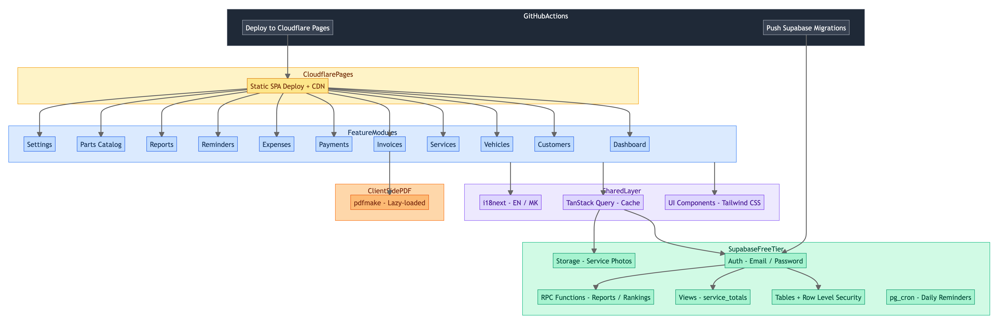

# AutoShop Manager

A full-featured workshop management application built for independent car mechanics. It handles the complete daily workflow — from registering customers and vehicles, through tracking services and parts, to generating invoices and monitoring business profitability.



## Motivation

A local mechanic needed a digital tool to replace paper notebooks and spreadsheets. The key requirements were:

- **Speed over polish** — the mechanic is working with greasy hands between cars; every screen must be fast to navigate and require minimal taps/clicks.
- **Zero running cost** — no monthly SaaS fees; the entire stack runs on free tiers (Supabase free plan + Cloudflare Pages for hosting).
- **Bilingual** — full Macedonian and English support, since the primary user operates in Macedonia.
- **Offline-friendly data** — aggressive client-side caching via TanStack Query so the app stays usable on spotty workshop Wi-Fi.

## Features

| Area | What it does |
|------|-------------|
| **Customers** | Contact info, notes, customer type (person/company), tax number for businesses. WhatsApp deep links for quick messaging. |
| **Vehicles** | Linked to customers. Brand, model, year, plate number, VIN, mileage tracking. |
| **Services** | Full service records per vehicle — description, labor cost, parts used (with buy/sell prices), status tracking through the lifecycle (in progress, completed, invoiced, paid). |
| **Parts Catalog** | Reusable parts library with default pricing. Autocomplete when adding parts to a service. |
| **Service Photos** | Before/after photos uploaded to Supabase Storage. Compressed client-side before upload. |
| **Invoices** | Invoice editor with live preview. Client-side PDF generation with Macedonian number-to-words conversion. Auto-incrementing invoice numbers. |
| **Payments** | Multiple payments per service. Tracks partial payments and remaining balance. Payment methods: cash, card, bank transfer. |
| **Expenses** | Workshop operating expenses by category (rent, utilities, tools, salary, etc.). |
| **Reminders** | Time-based and km-based service reminders per vehicle. Daily cron job generates notifications when a reminder is approaching. |
| **Reports** | Three tabs — Financial, Customers, Services. Revenue/expense charts, daily breakdown tables, customer and part rankings with server-side sorting and pagination. |
| **Dashboard** | Today's summary — revenue, expenses, cars currently in shop, upcoming reminders, unpaid services. Revenue trend chart (last 12 months). |
| **Notifications** | Bell icon notifications generated daily by `pg_cron` from active reminders. Dismissible in the dashboard. |
| **Settings** | Workshop profile (for invoices), brands/models management, invoice number configuration. |

## Tech Stack

| Layer | Technology | Why |
|-------|-----------|-----|
| **Frontend** | React 18, TypeScript, Vite | Fast builds, strong typing, excellent DX |
| **Styling** | Tailwind CSS | Utility-first, responsive by default |
| **Server State** | TanStack Query | Caching, background refetch, optimistic updates |
| **Routing** | React Router v7 | Route-level code splitting via `React.lazy()` |
| **Backend** | Supabase (PostgreSQL) | Free tier covers auth, database, storage, and RPCs — zero backend code to maintain |
| **Auth** | Supabase Auth | Email/password with Row Level Security on every table |
| **PDF** | pdfmake (client-side) | No server needed for invoice generation; lazy-loaded only on demand |
| **i18n** | i18next | Macedonian (primary) and English |
| **Hosting** | Cloudflare Pages | Free static SPA deployment with global CDN |
| **CI/CD** | GitHub Actions + Cloudflare Git Integration | Cloudflare Pages auto-deploys on push to `main`; GitHub Actions pushes Supabase migrations |

## Architecture

The app is a **single-page application** with no custom backend server. All business logic runs either in the browser or as PostgreSQL functions (RPCs) inside Supabase.

**Key architectural decisions:**

- **Feature-based module structure** — each domain (customers, vehicles, services, etc.) co-locates its components, hooks, API calls, and types in `src/features/[name]/`.
- **Server-side computation for reports** — financial summaries, rankings, and aggregations run as Postgres RPCs with server-side sorting and pagination, keeping the client lightweight.
- **Row Level Security everywhere** — every table has RLS policies scoped to `auth.uid()`. No data leaks between users by design.
- **Client-side PDF generation** — invoices are built with pdfmake directly in the browser, avoiding the need for a PDF server. The library is lazy-loaded to keep the initial bundle small.
- **Aggressive code splitting** — route-level splitting via `React.lazy()` + vendor chunk splitting via Rolldown keeps the initial page load under 35kB gzipped.
- **Automated reminders** — a `pg_cron` job runs daily at 7:00 AM UTC, checking active reminders and generating notifications for approaching service dates.
- **CI/CD pipeline** — Cloudflare Pages auto-deploys the frontend on every push to `main`; GitHub Actions pushes Supabase database migrations in a separate workflow.

## Database Schema

```text
User -> Customer -> Vehicle -> Service -> ServicePart
                                       -> ServiceImage
                                       -> Payment
                                       -> Invoice

User -> Expense
User -> Reminder (per Vehicle)
User -> Notification (generated from Reminders via pg_cron)
User -> PartsCatalog
User -> VehicleBrands -> VehicleModels
```

All tables use UUID primary keys, `created_at`/`updated_at` timestamps, and RLS policies. A `service_totals` view pre-computes revenue, cost, and balance per service for efficient querying.

## Project Structure

```text
src/
  features/           # Feature modules (co-located components, hooks, api, types)
    customers/
    vehicles/
    services/
    invoices/
    payments/
    expenses/
    reminders/
    reports/
    parts-catalog/
    dashboard/
    settings/
    auth/
    notifications/
  components/          # Shared UI components
    ui/                # Primitives (Button, Input, Card, Table, etc.)
  hooks/               # Shared custom hooks
  lib/                 # Utilities (supabase client, query client, dates, etc.)
  locales/             # i18n translations (en, mk)
  routes/              # Route definitions with lazy loading
  types/               # Auto-generated Supabase types

supabase/
  migrations/          # SQL migrations (schema, RPCs, cron jobs)
  functions/           # Edge Functions
```

## Constraints and Trade-offs

| Constraint | Impact |
|-----------|--------|
| **Zero cost** | Supabase free tier limits: 500MB database, 1GB storage, 50K monthly auth users. More than sufficient for a single-mechanic workshop. |
| **No custom server** | All complex queries are Postgres RPCs. No Node.js/Python backend to maintain or pay for. |
| **Client-side PDF** | pdfmake adds ~1.8MB but is lazy-loaded and only downloaded when generating an invoice — never on initial page load. |
| **Single-tenant by design** | RLS scopes everything to the logged-in user. Multi-workshop support would require schema changes. |
| **Macedonian locale** | Number-to-words conversion, date formatting, and all UI text support Macedonian as the primary language. |

## Getting Started

```bash
# Prerequisites: Node.js >= 20, Docker, Supabase CLI

npm install
supabase start
supabase db reset
npm run dev              # http://localhost:5173
```

For full setup instructions including production deployment to Supabase, Cloudflare Pages, and CI/CD configuration, see the **[Deployment Guide](docs/deployment-guide.md)**.

## Available Scripts

```bash
npm run dev              # Start dev server
npm run build            # Production build
npm run lint             # ESLint
npm run typecheck        # TypeScript check (tsc --noEmit)
```
